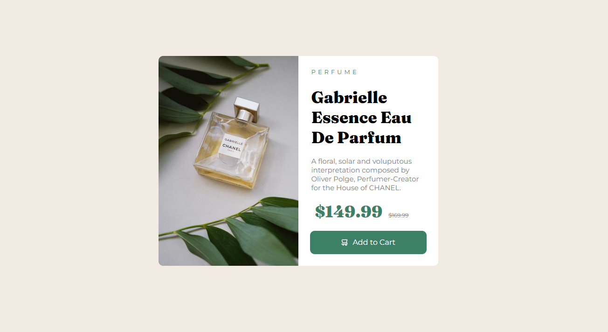

# Frontend Mentor - Product preview card component solution

This is a solution to the [Product preview card component challenge on Frontend Mentor](https://www.frontendmentor.io/challenges/product-preview-card-component-GO7UmttRfa). Frontend Mentor challenges help you improve your coding skills by building realistic projects. 

## Table of contents

- [Overview](#overview)
  - [The challenge](#the-challenge)
  - [Screenshot](#screenshot)
  - [Links](#links)
- [My process](#my-process)
  - [Built with](#built-with)
  - [What I learned](#what-i-learned)
  - [Continued development](#continued-development)
  - [Useful resources](#useful-resources)
- [Author](#author)
- [Acknowledgments](#acknowledgments)

## Overview

### The challenge

Users should be able to:

- View the optimal layout depending on their device's screen size
- See hover and focus states for interactive elements

### Screenshot

### Links

- Solution URL: [https://github.com/TopeGramms](Solution)
- Live Site URL: [https://topegramms.github.io/Product-Pro/](live)

## My process

### Built with

- Semantic HTML5 markup
- strikethrough
- CSS custom properties
- Flexbox
- CSS Grid
- 

### What I learned
 
 i learnt how to use 
 {
  display : Grid;
 }
  even though i end up using flex, i found the grid interesting BUT is still need to work and practise more. 

### Continued development

Using some flex tools

### Useful resources

- [google fonts](https://www.googlefonts.com) - This helped me for XYZ reason. I really liked this site and will use it going forward.

## Author

- Website - [TopeGramms](https://www.your-site.com)
- Frontend Mentor - [@yourusername](https://www.frontendmentor.io/profile/TopeGramms)
- Twitter - [@yourusername](https://www.twitter.com/TopeGramms)

## Acknowledgments

Special Thanks to My Friend instagram.com/quake_silver for some tips
